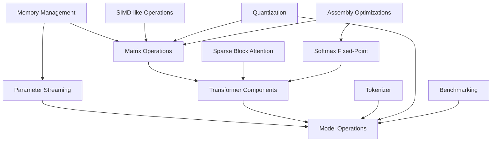

# GPT-2 BASIC Implementation Guide

This document provides a comprehensive guide for implementing the GPT-2 BASIC project, tying together all our design specifications and establishing a clear path for development. It serves as the central reference for the implementation process, ensuring all components work together seamlessly.

## Project Overview

GPT-2 BASIC aims to implement a scaled-down GPT-2 transformer model in FreeBASIC that is theoretically compatible with 486-era hardware constraints. The project demonstrates that modern AI concepts can be implemented on vintage hardware through careful optimization and innovative approaches.

### Key Constraints
- 32MB RAM limit
- 486 processor (DX4/100MHz ideal target)
- No modern SIMD instructions
- Limited FPU capabilities (especially on 486SX)

### Design Approach
Our approach balances authenticity to 486-era constraints with the need for a functional transformer model through:
1. Careful memory management
2. Optimized computation
3. Efficient data representation
4. Graceful adaptation to hardware limitations

## Component Relationships

## Implementation Order

The implementation follows this sequence to ensure components build upon each other properly:

### Phase 1: Core Infrastructure (Weeks 1-2)
1. Memory management system
2. Data structures and matrix operations
3. SIMD-like bit manipulation
4. Quantization implementation

### Phase 2: Computation Foundation (Weeks 3-4)
1. Fixed-point arithmetic
2. Block-sparse attention
3. Assembly optimizations for critical functions
4. Efficient matrix operations

### Phase 3: Transformer Components (Weeks 5-6)
1. Self-attention mechanism
2. Feed-forward networks
3. Layer normalization
4. Positional encoding

### Phase 4: Model Integration (Weeks 7-8)
1. Parameter streaming
2. Tokenizer implementation
3. Full model assembly
4. Text generation algorithms

### Phase 5: Testing and Optimization (Weeks 9-10)
1. Benchmarking system
2. Performance optimization
3. DOSBox compatibility
4. Memory usage verification

## Implementation Details by Component

### 1. Memory Management (`file_io.bas`, `data_structures.bas`)

#### Implementation Steps
1. Implement memory tracking system
   - Create `MemoryTracker` structure and initialization
   - Implement allocation and deallocation tracking
   - Add reporting functions

2. Develop matrix memory pool
   - Implement matrix reuse mechanism
   - Add best-fit allocation strategy
   - Create cleanup functions

3. Create parameter streaming system
   - Define model file format
   - Implement on-demand loading
   - Add prefetching optimization

#### Integration Points
- Matrix operations will use tracked allocation
- Model components will use matrix pooling
- Transformer layers will use parameter streaming

#### Success Criteria
- System operates within 32MB RAM limit
- No memory leaks detected
- Efficient memory reuse demonstrated
- Streaming performance meets targets

### 2. SIMD-like Operations (`simd_ops.bas`)

#### Implementation Steps
1. Develop value packing functions
   - Implement 4-bit, 8-bit, and 16-bit packing
   - Create unpacking functions
   - Add overflow handling

2. Create SIMD-like arithmetic
   - Implement parallel addition/subtraction
   - Add parallel multiplication
   - Create specialized comparison operations

3. Optimize matrix operations
   - Update matrix multiplication to use SIMD operations
   - Modify element-wise operations
   - Add CPU capability detection

#### Integration Points
- Matrix operations will use SIMD-like functions
- Fixed-point arithmetic will leverage bit manipulation
- Softmax will use SIMD-accelerated operations

#### Success Criteria
- 1.5-2x speedup for matrix operations
- Correct handling of overflow conditions
- Seamless integration with other components

### 3. Block-Sparse Attention (`block_sparse.bas`)

#### Implementation Steps
1. Implement sparse block data structures
   - Create `SparseBlock` and `SparseBlockMatrix` types
   - Develop block management functions
   - Add conversion between dense and sparse formats

2. Develop sparse attention algorithms
   - Implement block-sparse matrix multiplication
   - Create specialized causal masking
   - Add adaptive block size selection

3. Integrate with transformer components
   - Implement SparseSelfAttention function
   - Add memory-aware operation selection
   - Create benchmarking hooks

#### Integration Points
- Transformer components will use sparse attention
- Memory management will track sparse blocks
- SIMD-like operations will accelerate block processing

#### Success Criteria
- 40%+ memory reduction for attention
- Maintenance of computational efficiency
- Correct output compared to dense implementation

### 4. Assembly Optimizations (`asm_optimizations.bas`)

#### Implementation Steps
1. Implement fixed-point arithmetic in assembly
   - Create multiply and divide functions
   - Add square root and other mathematical operations
   - Implement FPU detection

2. Optimize critical matrix operations
   - Develop assembly inner loops for matrix multiply
   - Create optimized element-wise operations
   - Add CPU-specific optimizations

3. Integrate with BASIC code
   - Implement conditional compilation
   - Add fallback implementations
   - Create CPU capability detection

#### Integration Points
- Fixed-point operations will use assembly when available
- Matrix operations will call assembly for inner loops
- Softmax will use optimized exp/log functions

#### Success Criteria
- 2-3x speedup for critical operations
- Functional on both 486SX and 486DX
- Proper fallback when assembly not available

### 5. Model Integration (`model.bas`)

#### Implementation Steps
1. Implement model structure
   - Create transformer model representation
   - Add layer management
   - Implement parameter handling

2. Develop forward pass
   - Create token embedding lookup
   - Implement layer-by-layer processing
   - Add output projection

3. Create text generation algorithm
   - Implement greedy and temperature-based sampling
   - Add context management
   - Create memory-efficient generation

#### Integration Points
- Uses memory management for efficient operation
- Leverages transformer components for processing
- Integrates with tokenizer for input/output

#### Success Criteria
- Complete model inference implementation
- Memory-efficient operation within constraints
- Coherent text generation capability

## Detailed Timeline

| Week | Component Focus | Key Deliverables | Dependencies |
|------|----------------|------------------|--------------|
| 1 | Memory Management | `MemoryTracker`, `MatrixPool` implementations | None |
| 2 | SIMD-like Operations | `Pack_8bit`, arithmetic operations, matrix integration | Memory Management |
| 3 | Block-Sparse Attention | `SparseBlock` type, conversion functions, sparse operations | SIMD-like Operations |
| 4 | Fixed-Point & Assembly | Assembly optimizations, fixed-point arithmetic | None |
| 5 | Transformer Core | Self-attention, FFN, layer norm implementations | Block-Sparse Attention |
| 6 | Transformer Integration | Full transformer layer, multi-head attention | Transformer Core |
| 7 | Model Structure | Model representation, parameter handling | Transformer Integration |
| 8 | Text Generation | Token sampling, generation algorithms | Model Structure |
| 9 | Benchmarking | Performance metrics, memory tracking | Complete System |
| 10 | Final Optimization | DOSBox testing, performance tuning | Benchmarking |

## Development Process

### Code Organization
- Each component will be implemented in its own module (`.bas` file)
- Modules will have clear interfaces and minimal dependencies
- Common utilities will be extracted to shared modules
- Testing code will be separated from implementation

### Development Flow
1. Implement core data structures and utility functions
2. Create basic operations and algorithms
3. Add optimizations incrementally
4. Integrate components into working system
5. Test and benchmark performance
6. Iterate on bottlenecks and issues
7. Document code and design decisions

### Testing Approach
- Unit tests for individual components
- Integration tests for component combinations
- End-to-end tests for complete system
- Performance benchmarks for optimization
- Memory usage tracking for constraint verification
- DOSBox testing for 486-era compatibility

## Coding Standards

### Naming Conventions
- `PascalCase` for functions, subroutines, and types
- `camelCase` for variables
- `UPPERCASE` for constants
- `g_prefixed` for global variables
- Meaningful and descriptive names throughout

### Documentation
- Each module should begin with overview comments
- Functions should have descriptions of parameters and return values
- Complex algorithms should include detailed explanations
- Optimization techniques should be clearly documented
- Assembly code should be extensively commented

### Code Structure
- Clear separation of concerns between modules
- Minimize global state and side effects
- Use structured programming techniques
- Maintain consistent error handling
- Follow BASIC best practices for readability

## Conclusion

This implementation guide provides a comprehensive roadmap for developing the GPT-2 BASIC project. By following this structured approach, we can ensure that all components work together seamlessly while meeting the constraints of 486-era hardware.

The development process will be iterative, with careful testing and optimization at each stage. The end result will be a functioning transformer model that demonstrates the feasibility of modern AI concepts on vintage hardware.
